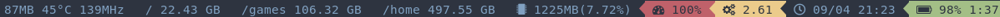
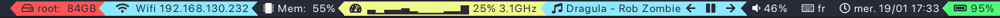

## Choosing your theme and icon set
To use a theme or icon set other than the default, add them to your configuration file like so:
```toml
[theme]
theme = "solarized-dark"
[icons]
icons = "awesome6"
```
Both the theme and icon set can be loaded from a separate file.
```toml
[theme]
theme = "<file>"
[icons]
icons = "<file>"
```
where `<file>` can be either a filename or a full path and will be checked in this order:

1. If full absolute path given, then use it as is: `/home/foo/custom_theme.toml`
2. If filename given, e.g. "custom_theme.toml", then first check `$XDG_CONFIG_HOME/i3status-rust/themes`
3. Then look for it in `$XDG_DATA_HOME/i3status-rust/themes`
4. Otherwise look for it in `/usr/share/i3status-rust/themes`

Notes:
- In case with icon sets, the file should be in the `icons` subdirectory instead of `themes`.
- You can omit the `.toml` extension while specifying `file` parameters.
- All the predefined themes are provided as files, so you use them as examples of how to write your own themes/icon sets.

# Available themes

Note: screenshots were generated using [this config](../gen-screenshots/screenshot_config.toml) with [this swaybar config](../gen-screenshots/swayconfig_i3rs).

* `plain` (default)

* `solarized-dark`

* `solarized-light`

* `slick`

* `modern`

* `bad-wolf`

* `gruvbox-light`

* `gruvbox-dark`

* `space-villain`

* `native` (like plain with no background and native separators)

* `semi-native` (like native but with background)

* `nord-dark` (polar night)

* `dracula`

* `srcery`

* `ctp-frappe`

* `ctp-latte`

* `ctp-macchiato`

* `ctp-mocha`


# Available icon sets

* `none` (default. Uses text labels instead of icons)
* `awesome4` (Font Awesome 4.x)
* `awesome5` (Font Awesome 5.x)
* `awesome6` (Font Awesome 6.x)
* `emoji`
* `material`
* `material-nf` (Any font from Nerd Fonts collection)

 **Note**: In order to use the material icon set, you need a patched material icons font which can be found [here](https://gist.github.com/draoncc/3c20d8d4262892ccd2e227eefeafa8ef/raw/3e6e12c213fba1ec28aaa26430c3606874754c30/MaterialIcons-Regular-for-inline.ttf). Make sure to pass it in your i3 configuration bar block.

## Overriding themes and icon sets

Create a block in the configuration called `theme` or `icons` like so:

```toml
[theme]
theme = "solarized-dark"
[theme.overrides]
# Example: redefine `idle` colors
idle_bg = "#123456"
idle_fg = "#abcdef"
# Example: swap `good` and `warning` colors
good_fg = { link = "warning_fg" }
good_bg = { link = "warning_bg" }
warning_fg = { link = "good_fg" }
warning_bg = { link = "good_bg" }

[icons]
icons = "awesome6"
[icons.overrides]
bat = [
    "| |",
    "|¼|",
    "|½|",
    "|¾|",
    "|X|",
]
bat_charging = "|^|"
```

Besides global overrides you may also use per-block overrides using the `theme_overrides`, `icons_overrides` and `icons_format` options available for all blocks.
For example:
```toml
[[block]]
block = "cpu"
icons_format = "{icon}"
[block.theme_overrides]
idle_bg = "#123456"
idle_fg = "#abcdef"
[block.icons_overrides]
cpu_boost_on = "ON"
cpu_boost_off = "OFF"
```

# Available theme overrides

All `bg` and `fg` overrides are html hex color codes like `#000000` or `#789ABC`. A fourth byte for alpha (like `#acbdef42`) works on some systems. `00` is transparent, `FF` is opaque.

The tints are added to every second block counting from the right. They will therefore always brighten the block and never darken it. The alpha channel, if it works, can also be alternated in the same way.

Feel free to take a look at the provided color schemes for reference.

* `idle_bg`
* `idle_fg`
* `good_bg`
* `good_fg`
* `warning_bg`
* `warning_fg`
* `critical_bg`
* `critical_fg`
* `info_bg`
* `info_fg`
* `alternating_tint_bg`
* `alternating_tint_fg`
* `separator_bg`
* `separator_fg`
* `separator`
* `end_separator`

# Available icon overrides

These can be directly set to a string containing the desired unicode codepoint(s) or use a TOML escape sequence like `"\uf0f3"` for up to 4-nibble codepoints and `"\U0001f312"` for up to 8-nibble codepoints.

You can find the codepoints in the documentation of the icon font you're using.

Refer to individual block's documentation for a list of used icons or [provided icon sets](../files/icons) for a complete list of icons.
